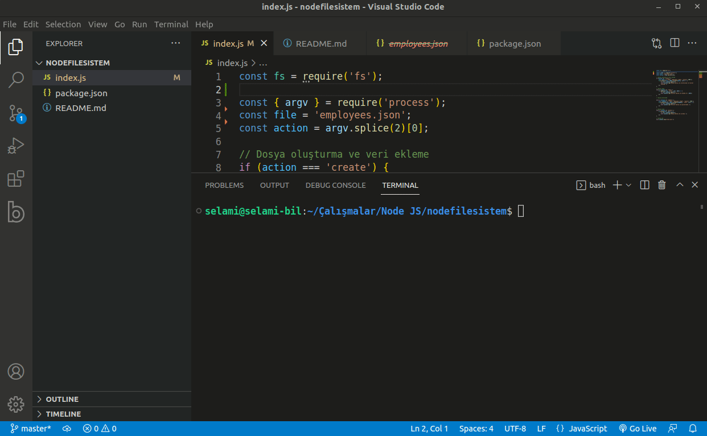

# Node JS fs Modülü İle Dosya İşlemleri

Node JS'nin dosya işlemleri için **fs** modülünü kullanıyor. Çok sayıda metod barındıran bu modül içerisinde biz
şuanda asenkron işlem yapan bazı metodları çalışacağız. Bu metodlar şunlardır.

- fileWrite
- fileRead
- fileUnlink


## fileWrite

Dosya oluşturmak ve dosyaya yazmak için kullanılır.

## fileRead

Dosya okumak için kullanılır.

## fileUnlink

Dosya silmek için kullanılır.

## Komut Satırı İle İşlem Yapmak

Örnekleri çalıştırmak için komut satırından veri alıp ona göre işlem yapma yöntemini tercih ettik.

Dosya oluşturma için **create**, dosya okuma için **read**, dosya güncelleme için **update** ve dosya silme için **delete** parametrelerini kullabilirsiniz. Kullanım şekli

```node index parametre```

şeklindedir. Burada parametre yerine yapacağınız işleme uygun olan yukarıda isimlerini verdiğimiz parametreleri kullanabilirsiniz.

Mesela dosya oluşturmak için

```node index create```

komutunu girebiliriz. Bu şekilde **employees.json** dosyası oluşturulack ve içerisine ilk veri yazılacaktır. Diğer işlemleri kendiniz deneyerek sonuçlarını görebilirsiniz.